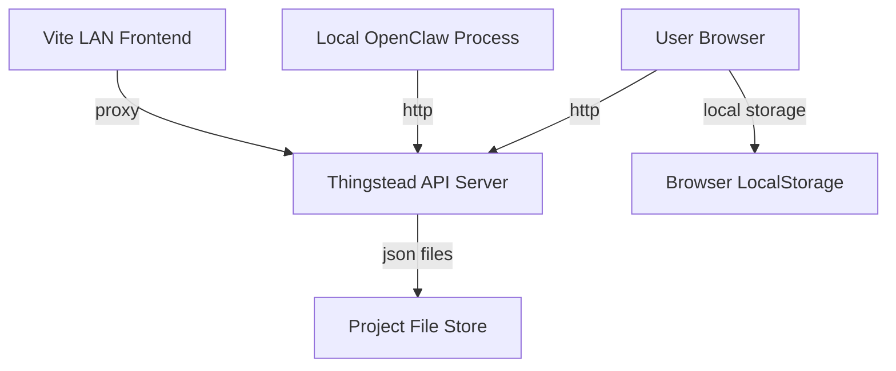

## Executive summary
Thingstead’s highest-risk theme is unauthorized modification or exfiltration of regulatory project data through unauthenticated local/LAN API surfaces when the server is exposed beyond strict localhost workflows. The most important hot spots are the runtime API server write endpoints, the lack of authz/CSRF boundaries, and integrity-signing semantics that are tamper-evident but not identity-anchored for regulatory-grade attestations.

## Scope and assumptions
- In scope:
  - `/Users/nikodemus/Documents/Thingstead+/server/` runtime API surfaces.
  - `/Users/nikodemus/Documents/Thingstead+/src/` client data handling, sync, import/export, integrity/signing, markdown rendering.
  - `/Users/nikodemus/Documents/Thingstead+/scripts/dev-lan.mjs` and `/Users/nikodemus/Documents/Thingstead+/package.json` run-mode exposure.
- Out of scope:
  - External SaaS/cloud infrastructure (none evidenced).
  - Third-party dependency internals under `node_modules/`.
- User-confirmed context:
  - Internet exposure: no.
  - Data sensitivity: regulatory.
  - OpenClaw callers: fully trusted local processes at present.
- Key assumptions:
  - “No internet exposure” remains true operationally.
  - Local machine and browser profile are not already compromised.
  - Regulatory controls may still require stronger provenance and access control even in local-first mode.
- Open questions that materially affect ranking:
  - Is `npm run dev` (host `0.0.0.0`) ever used on shared/untrusted LANs? Evidence: `/Users/nikodemus/Documents/Thingstead+/package.json` script `dev`.
  - Are there mandatory regulatory controls for audit immutability/non-repudiation beyond local integrity checks?

## System model
### Primary components
- Browser SPA (React/Vite) handles project lifecycle, markdown rendering, import/export, local persistence, and LAN sync bootstrap. Evidence: `/Users/nikodemus/Documents/Thingstead+/src/contexts/ProjectContext.jsx`, `/Users/nikodemus/Documents/Thingstead+/src/utils/importExport.js`.
- Local API server (Node `http`) serves static app and JSON APIs for project CRUD and OpenClaw advisory data. Evidence: `/Users/nikodemus/Documents/Thingstead+/server/server.mjs`.
- Local storage backends:
  - Browser `localStorage` for project cache/settings/signing keys. Evidence: `/Users/nikodemus/Documents/Thingstead+/src/utils/storage.js`, `/Users/nikodemus/Documents/Thingstead+/src/utils/projectIntegrity.js`.
  - Filesystem JSON project store under `.openclaw-data/projects`. Evidence: `/Users/nikodemus/Documents/Thingstead+/server/server.mjs` (`DATA_DIR`, `PROJECTS_DIR`, CRUD handlers).
- Integrity/ledger kernel computes hashes and append-only governance events but does not itself enforce endpoint authn/authz. Evidence: `/Users/nikodemus/Documents/Thingstead+/src/kernel/integrity.js`, `/Users/nikodemus/Documents/Thingstead+/src/state/projectReducer.js`.

### Data flows and trust boundaries
- User/browser -> SPA state and localStorage
  - Data: regulatory project records, settings, signing keypair.
  - Channel: browser runtime APIs (`localStorage`, JS state).
  - Security guarantees: same-origin browser model only.
  - Validation/enforcement: normalization and schema checks on import paths; no at-rest encryption. Evidence: `/Users/nikodemus/Documents/Thingstead+/src/utils/normalizeProject.js`, `/Users/nikodemus/Documents/Thingstead+/src/utils/validation/validateImportedProject.js`.
- Browser SPA -> Local API (`/api/*`)
  - Data: full project objects, delete requests, OpenClaw metadata/drafts/heartbeats.
  - Channel: HTTP fetch.
  - Security guarantees: none at API layer (no auth, no CSRF tokens, no origin checks).
  - Validation/enforcement: basic JSON parse and body size cap; ID format checks; no schema enforcement on PUT payload. Evidence: `/Users/nikodemus/Documents/Thingstead+/server/server.mjs`.
- Local API -> Filesystem JSON store
  - Data: entire project JSON blobs and indices.
  - Channel: filesystem writes (`atomicWriteJson`).
  - Security guarantees: atomic rename durability for writes.
  - Validation/enforcement: minimal structural checks before write; no access control or record-level authorization. Evidence: `/Users/nikodemus/Documents/Thingstead+/server/server.mjs`.
- OpenClaw local process -> OpenClaw API endpoints
  - Data: advisory drafts, heartbeat agent IDs.
  - Channel: HTTP to `/api/openclaw/*`.
  - Security guarantees: assumed trusted local callers.
  - Validation/enforcement: required field presence and safe ID regex only. Evidence: `/Users/nikodemus/Documents/Thingstead+/server/server.mjs`, `/Users/nikodemus/Documents/Thingstead+/src/utils/openclawBridge.js`.
- Dev LAN mode trust split
  - Data: UI traffic over LAN, API proxied to loopback in `dev:lan` mode.
  - Channel: Vite proxy.
  - Security guarantees: API loopback restriction only in `dev:lan`; not in `dev`.
  - Validation/enforcement: process-level topology control. Evidence: `/Users/nikodemus/Documents/Thingstead+/scripts/dev-lan.mjs`, `/Users/nikodemus/Documents/Thingstead+/package.json`.

#### Diagram

## Assets and security objectives
| Asset | Why it matters | Security objective (C/I/A) |
|---|---|---|
| Project governance records (`phases`, artifacts, notes) | Contains regulatory evidence and decision rationale | C, I |
| Gate decisions, waiver history, audit/ledger trails | Drives governance compliance and attestability | I |
| Export bundles and imported payloads | Portable cross-device governance source of truth | I, C |
| API write capability (`PUT/POST/DELETE`) | Can overwrite/delete all project data | I, A |
| Local signing private key (`cpmai-signing-keypair-v1`) | Used to sign integrity metadata and claims | C, I |
| `.openclaw-data/projects/*.json` availability | Single persistence plane for LAN/API mode | A, I |

## Attacker model
### Capabilities
- Malicious local webpage visited by user can attempt cross-origin requests to local API endpoints.
- Adversary on same LAN can target server if launched with broad host binding (`0.0.0.0`).
- Untrusted local process/user context can call unauthenticated API endpoints directly.
- Adversary with local browser profile access can read/replace localStorage signing material.

### Non-capabilities
- Internet remote attacker directly reaching this service (user confirmed no internet exposure).
- Untrusted third-party OpenClaw agents today (user confirmed trusted local only).
- Server-side RCE via templating/eval was not evidenced in runtime paths.

## Entry points and attack surfaces
| Surface | How reached | Trust boundary | Notes | Evidence (repo path / symbol) |
|---|---|---|---|---|
| `GET /api/projects` | Browser/local process HTTP | Local caller -> API server | Enumerates available project metadata | `/Users/nikodemus/Documents/Thingstead+/server/server.mjs` `handleApi` |
| `PUT /api/projects/:id` | Browser/local process HTTP | Local caller -> API server -> file store | Writes full project object with minimal server-side schema controls | `/Users/nikodemus/Documents/Thingstead+/server/server.mjs` lines around write path |
| `DELETE /api/projects/:id` | Browser/local process HTTP | Local caller -> API server -> file store | Deletes project file; no authz guard | `/Users/nikodemus/Documents/Thingstead+/server/server.mjs` delete branch |
| `POST /api/openclaw/proposals` | OpenClaw bridge/local process | Local caller -> API server | Stores advisory draft content | `/Users/nikodemus/Documents/Thingstead+/server/server.mjs` `handleOpenClawApi` |
| `POST /api/openclaw/heartbeat` | OpenClaw bridge/local process | Local caller -> API server | Registers/updates agent heartbeat and IDs | `/Users/nikodemus/Documents/Thingstead+/server/server.mjs` |
| Import JSON payload | UI import flow | User file/text -> parser/validator | Validation exists but permissive options and migration paths can admit weak provenance data | `/Users/nikodemus/Documents/Thingstead+/src/utils/importExport.js`, `/Users/nikodemus/Documents/Thingstead+/src/utils/validation/validateImportedProject.js` |
| Markdown preview renderer | Artifact notes editor | User content -> markdown/html render | Sanitized with DOMPurify before `dangerouslySetInnerHTML` | `/Users/nikodemus/Documents/Thingstead+/src/components/MarkdownEditor.jsx` |
| Runtime bind mode `dev` | npm script execution | Host network -> API listener | `--host 0.0.0.0` broadens exposure | `/Users/nikodemus/Documents/Thingstead+/package.json` script `dev` |

## Top abuse paths
1. Attacker on same LAN discovers exposed dev instance -> sends unauthenticated `PUT /api/projects/:id` with forged project JSON -> governance artifacts/decisions are altered -> regulatory evidence integrity is compromised.
2. Victim visits malicious website while local server is running -> page triggers cross-origin state-changing request to local API -> project data is overwritten/deleted without user intent -> integrity and availability loss.
3. Local malware/process reads `.openclaw-data/projects` and modifies files directly -> app loads tampered governance data -> user operates on compromised compliance artifacts.
4. Malicious local process floods `POST /api/openclaw/proposals` with large numbers of drafts -> JSON files grow and index scans slow -> UI/API degradation and potential storage exhaustion.
5. Insider with browser-profile access extracts `cpmai-signing-keypair-v1` from localStorage -> signs altered project bundle with stolen key -> tampered content appears internally “signed.”
6. Operator runs `npm run dev` on shared/untrusted network -> unauthorized host enumerates projects via `GET /api/projects` -> sensitive regulatory metadata disclosure.
7. Attacker submits syntactically valid but semantically weak project object via API write path -> server persists it without strong schema/profile enforcement -> downstream governance logic may process malformed state.

## Threat model table
| Threat ID | Threat source | Prerequisites | Threat action | Impact | Impacted assets | Existing controls (evidence) | Gaps | Recommended mitigations | Detection ideas | Likelihood | Impact severity | Priority |
|---|---|---|---|---|---|---|---|---|---|---|---|---|
| TM-001 | LAN attacker or local untrusted process | Server reachable on non-loopback or attacker has local host access; no endpoint auth required | Call unauthenticated CRUD/OpenClaw endpoints to read/modify/delete project data | Unauthorized data access and tampering of regulatory records | Project records, audit/ledger integrity, availability | ID regex and 2MB body cap; atomic write durability. Evidence: `server/server.mjs` | No authn/authz, no network ACL enforcement in app, no per-project capability tokens | Add mandatory authn for API writes (mTLS token or signed local session), default bind `127.0.0.1`, optional allowlist of client origins/IPs | Log all write/delete with source IP/user-agent and alert on unknown origin or burst writes | Medium | High | high |
| TM-002 | Malicious website in user browser session | User browses attacker page while local server running and accessible; browser can send cross-origin requests | CSRF-style request submission to local API state-changing endpoints | Silent project mutation/deletion without explicit user action | Project records, availability | JSON parsing and path checks only. Evidence: `server/server.mjs` | No CSRF token/origin validation, no same-site cookie model (API is stateless unauthenticated) | Enforce `Origin`/`Referer` checks for write verbs, require anti-CSRF nonce or authenticated bearer token, optionally require custom header validated server-side | Add audit field for source origin; alert on writes lacking expected origin/user agent | Medium | High | high |
| TM-003 | Malicious/buggy local caller | Ability to call `PUT /api/projects/:id` | Submit structurally weak or policy-bypassing full project object for persistence | Governance decisions can be bypassed or corrupted, undermining compliance posture | Project state integrity, gate decision correctness | Client-side normalization/validation exists. Evidence: `src/utils/validation/validateImportedProject.js` | Server does not enforce full schema/profile validation before write | Add strict server-side schema + plan-profile validation on PUT and reject invalid transitions | Record validation failures and rejected transition attempts; monitor repeated failures | Medium | Medium | medium |
| TM-004 | Local abusive process or accidental loop | Ability to repeatedly call write endpoints | High-volume writes/proposals increase file count/size and index rebuild costs | DoS-like degradation, storage exhaustion, slower recoverability | Availability of API/UI and file store | Per-request body cap (2MB). Evidence: `server/server.mjs` | No request rate limiting or quota controls in active runtime | Implement per-client rate limits, project size quotas, and max advisory drafts per project | Emit metrics for request rates, file size growth, and index rebuild latency | Medium | Medium | medium |
| TM-005 | Local compromise / insider with profile access | Access to browser localStorage or exported bundles | Steal or replace local signing keypair; re-sign tampered project as seemingly valid | Weak non-repudiation for regulatory evidence; provenance disputes | Signing keys, exported evidence bundles, compliance attestations | Hashing and signing utilities exist. Evidence: `src/utils/projectIntegrity.js`, `src/kernel/integrity.js` | Signing key kept in localStorage and not hardware- or identity-bound; trust model not explicit in UI | Move keys to OS keychain/WebAuthn/hardware-backed store; pin trusted signer identities; show trust status and signer provenance in UI | Alert when signer key rotates unexpectedly; track signer fingerprints in audit logs | Medium | High | high |
| TM-006 | Future developer misconfiguration | `server/auth.mjs` gets wired into runtime without hardening | Deploy auth middleware with hardcoded default secret | Token forgery and auth bypass in future deployment variants | Future auth boundary integrity | File currently not imported by runtime. Evidence: `server/auth.mjs`, import search | Hardcoded secret placeholder and CommonJS style mismatch in ESM repo can create insecure quick-fix integrations | Remove file or replace with env-driven secret management + secure defaults + tests before any integration | CI check preventing hardcoded secrets and dead security stubs in `server/` | Low (current) | High (if activated) | medium |

## Criticality calibration
- Critical:
  - Unauthorized remote overwrite/deletion of regulatory project data in a deployment considered production evidence-of-record.
  - Proven tampering of audit/ledger artifacts with no reliable detection path.
  - Compromise that enables persistent cross-tenant or internet-scale abuse (not currently evidenced).
- High:
  - LAN/local unauthorized write access to API leading to material integrity loss (`TM-001`).
  - CSRF-driven silent mutation of local governance records (`TM-002`).
  - Signing/provenance subversion that invalidates regulatory attestability (`TM-005`).
- Medium:
  - Schema/policy bypass through server-side under-validation (`TM-003`).
  - Availability degradation through unthrottled local API abuse (`TM-004`).
  - Insecure security stub likely to cause issues if later activated (`TM-006`).
- Low:
  - Minor metadata leakage where records are non-sensitive (not your stated case).
  - Short-lived local-only inconsistencies recoverable from snapshots.
  - Dead code that is never shipped nor reachable and has no operational path.

## Focus paths for security review
| Path | Why it matters | Related Threat IDs |
|---|---|---|
| `/Users/nikodemus/Documents/Thingstead+/server/server.mjs` | Primary runtime trust boundary and all API read/write logic | TM-001, TM-002, TM-003, TM-004 |
| `/Users/nikodemus/Documents/Thingstead+/package.json` | `dev` host binding controls network exposure posture | TM-001 |
| `/Users/nikodemus/Documents/Thingstead+/scripts/dev-lan.mjs` | Demonstrates safer loopback API topology to preserve | TM-001 |
| `/Users/nikodemus/Documents/Thingstead+/src/utils/lanSync.js` | Defines browser-driven remote API interactions and write paths | TM-001, TM-002 |
| `/Users/nikodemus/Documents/Thingstead+/src/contexts/ProjectContext.jsx` | Automatic sync behavior on startup/focus can amplify unintended remote state changes | TM-001, TM-003 |
| `/Users/nikodemus/Documents/Thingstead+/src/utils/validation/validateImportedProject.js` | Core validation boundary quality for imported or migrated project objects | TM-003 |
| `/Users/nikodemus/Documents/Thingstead+/src/utils/importExport.js` | Export/import control plane for regulatory evidence portability | TM-003, TM-005 |
| `/Users/nikodemus/Documents/Thingstead+/src/utils/projectIntegrity.js` | Key storage and signing trust model determine provenance strength | TM-005 |
| `/Users/nikodemus/Documents/Thingstead+/src/kernel/integrity.js` | Integrity semantics and verification behavior underpin audit claims | TM-005 |
| `/Users/nikodemus/Documents/Thingstead+/server/auth.mjs` | Dead security stub with hardcoded secret is a future integration hazard | TM-006 |
